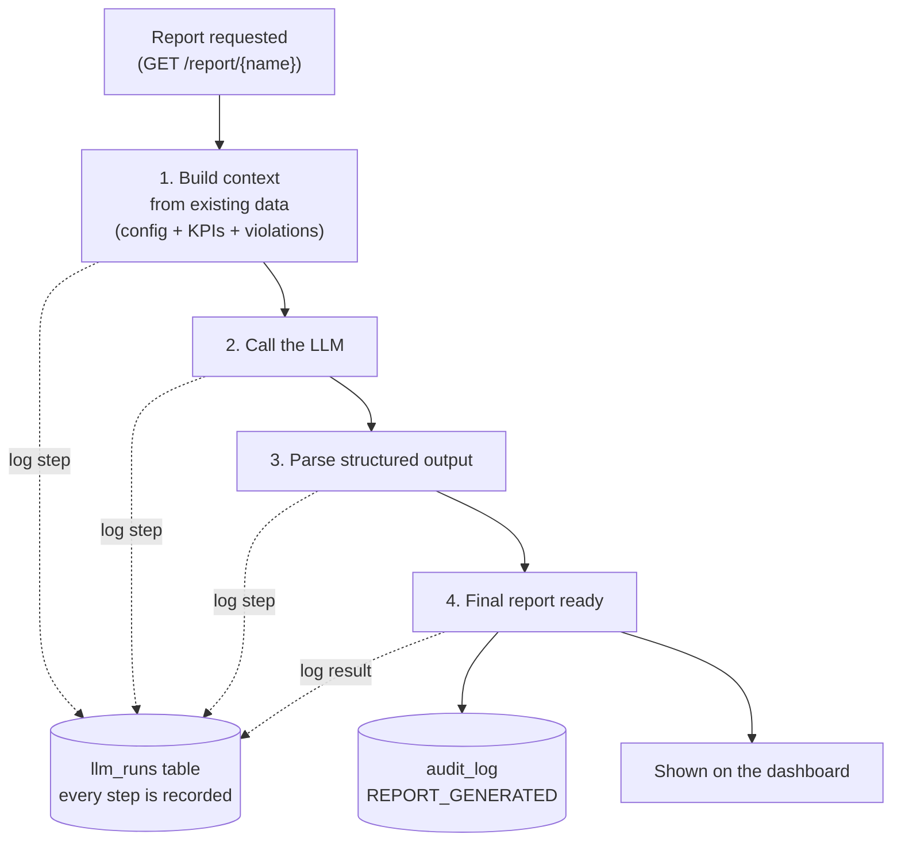

# LLM Workflow — Overview
## Capstone Project: Data Freshness Monitoring & Insights Agent

> A general overview of how the LLM report feature works: the flow of steps, the
> fact that **every step is stored** for debugging, and **where the final result
> lives**. (Design detail is in `llm_report_plan.md`; UI in `llm_frontend_plan.md`.)

---

## Workflow

Each numbered step is recorded as it happens (dotted lines). If any step fails, the
error is recorded too — so a broken run is always debuggable.

---

## Where every step is stored — the `llm_runs` table

A new table in **`governance.db`**. **One row per LLM run**, updated as the run
moves through the steps above. It captures the **entire lifecycle** so nothing
about a run is lost:

- **What was sent:** the input context built from our data, plus the prompt and
  the request settings (model, parameters).
- **What came back:** the raw LLM response and the token usage.
- **The result:** the parsed report (the final output — see below).
- **If it failed:** which step it failed at, the error message, and the full
  traceback.
- **When:** start time, end time, and how long it took.

This is the debugging record — if a report looks wrong or a run errors out, you
open its `llm_runs` row and see exactly what happened at each step.

### Fields in the `llm_runs` table

| Field | What it stores |
|---|---|
| `run_id` | Unique id for the run (also used to link from the audit log) |
| `entity_type` | What kind of run it is (`report`; future: other LLM features) |
| `entity_id` | What it was about (the pipeline name) |
| `status` | `started` → `success` or `error` |
| `stage` | The last step reached (`build_context` / `call_llm` / `parse_output` / `done`) |
| `provider` | The LLM provider (`anthropic`) |
| `model` | The model used |
| `base_url` | The exact endpoint/gateway that was called |
| `params_json` | Request settings (temperature, max tokens, etc.) |
| `context_json` | The input context built from our data |
| `system_prompt` | The system instruction sent to the model |
| `user_prompt` | The user message sent to the model |
| `raw_response_json` | The full, untouched LLM response |
| `output_json` | The parsed final report (the four sections) |
| `prompt_tokens` / `completion_tokens` / `total_tokens` | Token usage |
| `stop_reason` | Why the model stopped |
| `error_type` / `error_message` / `error_traceback` | Failure details (only if it failed) |
| `started_at` / `finished_at` / `duration_ms` | Timing |

---

## Where the final result is stored

The finished report (the LLM's output) is stored **in that same `llm_runs` row**
as the run's result — that is the durable copy of what the model produced.

Two more things happen when a run succeeds:

- **`audit_log`** gets a short **`REPORT_GENERATED`** entry (for the governance /
  "who did what" trail), linked back to the run.
- The result is **cached** briefly so repeat views don't trigger a new LLM call.

The dashboard then reads the report and displays it on the pipeline's page.

---

## The report itself (what the user sees)

The LLM returns a structured report with four parts:

- **Executive summary** — a short plain-English overview.
- **Root-cause indicators** — likely reasons behind the issues.
- **Risk assessment** — how serious the situation is.
- **Recommended actions** — suggested next steps.

If the LLM is turned off (no API key) or a call fails, the page falls back to a
simple placeholder instead — so the app always works.

---

## In one line

**A report is requested → context is built from existing data → the LLM is called
and its output parsed → every step (and the final result) is saved in `llm_runs`,
a success is noted in `audit_log`, and the report is shown on the dashboard.**
