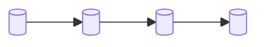

# Slide 1 — Title
**Page type:** Content (title) · **Layout:** centered, minimal

---

## [ON SLIDE]
- **Title (large):** Data Freshness Monitoring & Insights Agent
- **Subtitle:** Proactive governance for a pharma commercial-analytics data platform
- **Line 3:** Capstone Project — **Group 6**
- *(No date. No author list clutter — just the group.)*
- Optional: a single faint background motif (pipeline / data-flow line art), low opacity.

## [VISUAL / DIAGRAM DRAFT]
No diagram. Keep it clean: title block centered, generous whitespace, one accent underline
under the title in primary blue `#2563EB`.

Optional subtle visual (rebuild as vector, very low opacity so text stays crisp):

→ Use only as faint background line art suggesting a pipeline; do not label it.

## [SCREENSHOT]
None.

## [SPEAKER NOTES]
- "Good morning — we're Group 6. Our capstone is a Data Freshness Monitoring & Insights Agent."
- One sentence hook: "It watches a fleet of data pipelines, catches delivery problems before
  business users do, and puts a human-approved governance trail around every finding."
- Keep it to ~15 seconds; move on.
