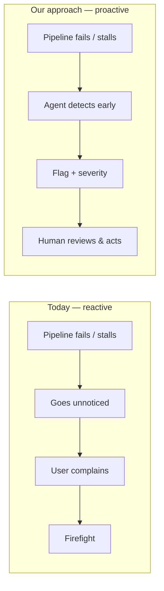

# Slide 2 — The Problem & Motivation
**Page type:** Content · **Layout:** left text / right diagram

---

## [ON SLIDE]
Headline: **Data problems are found too late**

- Reports rely on **timely, complete** data
- Delays & failed loads noticed only **after users complain**
- Result: bad decisions, **lost trust** in the platform
- Today's monitoring = **manual log-reading**, reactive

Right side: the "reactive vs. proactive" contrast diagram (below).

## [VISUAL / DIAGRAM DRAFT]
Rebuild as two clean horizontal flows stacked — top in red (today), bottom in green (our goal).

→ Style: TODAY row muted/red arrows; OURS row blue→green. Use warning/critical colors for the
top flow to make the pain obvious at a glance.

## [SCREENSHOT]
None.

## [SPEAKER NOTES]
- Frame the pain: "Organizations only find out data is stale when a dashboard looks wrong in a meeting."
- Emphasize cost: operational inefficiency + erosion of trust in the data platform.
- Land the transition: "So we flip it from reactive to proactive — detect before anyone downstream notices."
- This is straight from the capstone brief's business challenge; keep it crisp (~30s).
