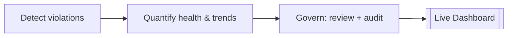

# Slide 3 — Solution Overview
**Page type:** Content · **Layout:** headline + 3 capability pillars + one flow strip

---

## [ON SLIDE]
Headline: **An intelligent monitoring layer over the data fleet**

Three pillars (icon + 2-3 words each):
- 🔎 **Detect** — 7 violation types, automatically
- 📊 **Quantify** — fleet health score & trends
- ✅ **Govern** — human review + audit trail

One-line value prop (footer band): *Detect early · Quantify health · Act with governance*

## [VISUAL / DIAGRAM DRAFT]
A simple left→right capability flow (rebuild as 3 clean cards feeding one dashboard icon).

→ Style: three equal cards in primary blue, arrow into a single "dashboard" chip.
Keep it high-level; the real architecture is the next slide.

## [SCREENSHOT]
None on this page. *(The Overview dashboard screenshot appears later, on page 10.)*

## [SPEAKER NOTES]
- "Our solution does three things: detect problems, quantify fleet health, and govern the response."
- Stress it's a *layer* — it sits on top of pipeline execution history, not inside the pipelines.
- Set expectations for the deck: "We'll show the architecture and data model, then how detection
  works, and walk the dashboard through **screenshots** — we're not doing a live demo, by design,
  so we can show each view at its best."
- ~30s.
