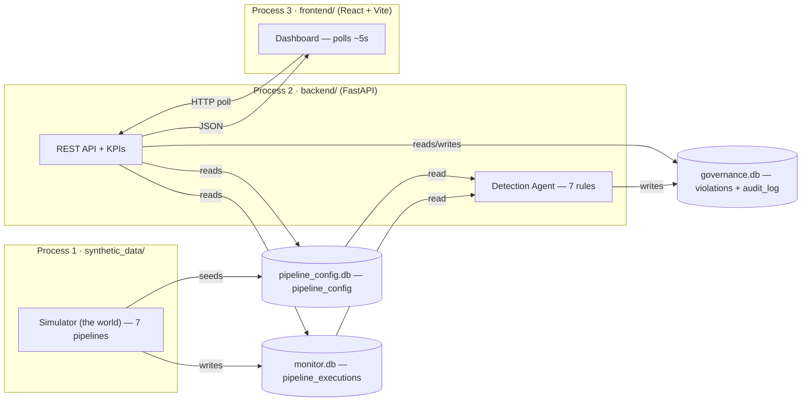

# Slide 4 — ⭐ System Architecture (REQUIRED)
**Page type:** Content (deep-dive) · **Layout:** full-width diagram + one principle band

> This is a required slide. Make the diagram the hero; minimal text.

---

## [ON SLIDE]
Headline: **Three components, one source of truth**

- Left→right: **Generator → Backend (API + Agent) → Dashboard**
- They share state **only** through 3 SQLite files + a REST API (polling)
- **Key principle band:** *One writer per database file + WAL mode → zero write contention*
- Footer caption (small, not a code slide): *Python · FastAPI · SQLite · React + TypeScript · Recharts*

## [VISUAL / DIAGRAM DRAFT]
**Hero diagram** — rebuild as clean vector boxes. This is the redrawn version of the ASCII diagram
in `PROJECT_OVERVIEW.md`.

**Annotate on the rebuilt graphic:**
- Label each DB with its **single writer** (simulator / simulator-seed / backend).
- Small "WAL mode" tag near the DB cluster.
- Color the 3 process groups distinctly (blue / slate / sky); DBs as cylinders in gray.

## [DATA — use these exact facts]
- **3 processes:** `python -m synthetic_data` (writer) · `uvicorn backend.main:app` (single worker) · `npm run dev` (Vite :5173)
- **3 SQLite files, one writer each:** `monitor.db` ← simulator · `pipeline_config.db` ← simulator (seed once) · `governance.db` ← backend only
- **WAL settings:** `journal_mode=WAL`, `busy_timeout=5000`, `synchronous=NORMAL`
- Backend `ATTACH`es monitor + config **read-only** → a single SQL query can join across all 3 files
- Detector re-scans every **1s**; frontend polls every **~5s**; ~1k-row rescan takes a few ms

## [SCREENSHOT]
None (architecture is a diagram, not a screenshot).

## [SPEAKER NOTES]
- Walk left→right once: "The generator fabricates realistic runs; the backend detects violations
  and serves the API; the React app polls and renders."
- The engineering point to emphasize: **one writer per database file.** "We split storage into three
  SQLite files so each file has exactly one writer — that removes cross-process write contention
  entirely, and WAL mode lets readers never block."
- Mention the backend ATTACHes the other two DBs read-only, so a single SQL query can join across all three.
- If asked 'why not one DB / why not a message bus?': runs are *stored*, not *streamed*; polling is
  simple and self-healing — see the future-scope slide for the scaling path.
- ~60-75s (this is a headline slide).
