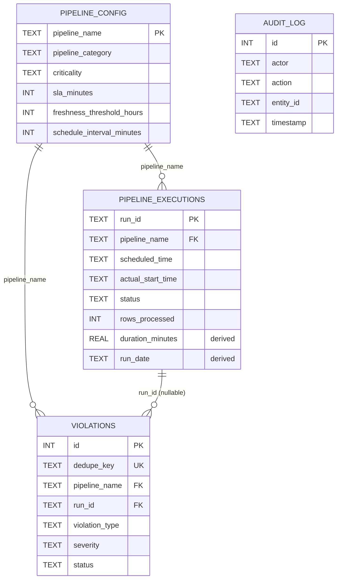

# Slide 5 — ⭐ Data Model (REQUIRED)
**Page type:** Content (deep-dive) · **Layout:** ERD diagram + one principle line

> Required slide. Show the schema as an ERD; keep field lists compact (key fields only).

---

## [ON SLIDE]
Headline: **Three databases, one join key**

- `pipeline_config` — what "good" looks like (SLA, freshness, cadence)
- `pipeline_executions` — one row per run (raw facts)
- `violations` + `audit_log` — what the agent found + who acted
- **Principle line:** *Emit raw facts only → derive & learn everything else*

## [VISUAL / DIAGRAM DRAFT]
**Hero diagram** — rebuild as a clean ERD (crow's-foot). Show only key fields; note derived/learned.

**Annotate on the rebuilt graphic:**
- Group the three cylinders by file: `pipeline_config.db`, `monitor.db`, `governance.db`.
- Tag `duration_minutes` / `run_date` as **derived at ingest**; add a callout: *volume baseline = **learned** from history (not stored)*.
- Mark `dedupe_key` as the idempotency key.

## [DATA — use these exact facts]
- **Shipped snapshot:** `pipeline_config` = **7 rows** · `pipeline_executions` = **1,017 runs** (907 SUCCESS / 110 FAILED).
- **`pipeline_executions`** = **9 emitted fields** + **2 derived** (`duration_minutes`, `run_date`).
  - Emitted: `run_id, pipeline_name, scheduled_time, actual_start_time, end_time, status, rows_processed, error_code, error_message`
  - Indexes: `(pipeline_name, scheduled_time)` and `(scheduled_time)`
- **`pipeline_config`** = **8 fields** (adds `owner_team`, `description` beyond those shown).
- **`violations.violation_type`** ∈ { SLA_BREACH, DELAYED_START, VOLUME_ANOMALY, FAILURE, RECURRING_FAILURE, MISSING_LOAD, FRESHNESS }
- **`violations.status`** ∈ { open, reviewed, dismissed, escalated } · **severity** ∈ { LOW, MEDIUM, HIGH, CRITICAL }
- **`run_id` is NULL** for MISSING_LOAD and FRESHNESS (no single run to point at).
- **`audit_log` is never pruned** (compliance trail); executions prune at 60 days.

## [SCREENSHOT]
None (schema diagram).

## [SPEAKER NOTES]
- The philosophy is the story: "The simulator emits **only raw facts**. Anything derivable —
  duration, run_date — is computed at ingest. Anything learnable — like volume baselines — the
  agent computes from history, not from config."
- Why that matters: "It keeps the agent honest — it has to *derive* and *learn*, exactly like it
  would against real pipeline logs."
- Point at the join key `pipeline_name` and the nullable `run_id` (freshness / missing-load have no run).
- Mention `dedupe_key`: "every violation has a deterministic key, so re-scanning every second is
  idempotent — no duplicates."
- ~60s.
