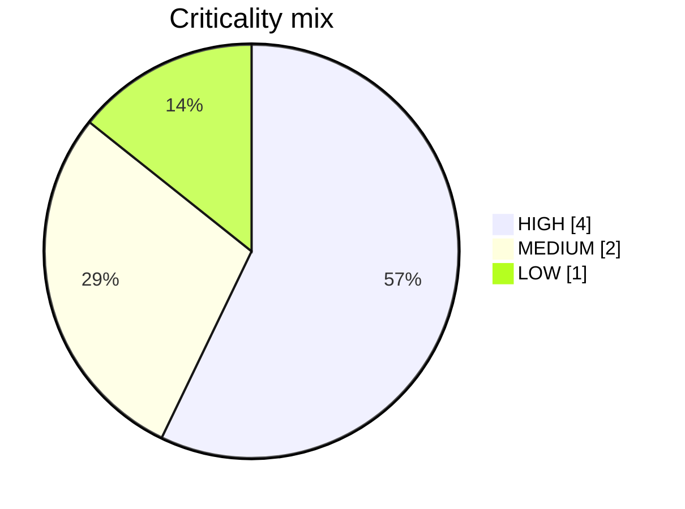

# Slide 6 — The 7-Pipeline Fleet
**Page type:** Content · **Layout:** compact table + small distribution chart

---

## [ON SLIDE]
Headline: **A realistic pharma data fleet — built for variety**

Compact table to put on the slide (key columns — keep it readable):

| # | Pipeline | Category | Crit. | Cadence | SLA | Fresh |
|---|---|---|---|---|---|---|
| 1 | `hcp_prescriber_data_sync` | CRM | HIGH | daily | 120m | 24h |
| 2 | `rx_claims_daily_load` | Claims | HIGH | daily | 180m | 26h |
| 3 | `formulary_coverage_update` | Compliance | HIGH | 12h | 90m | 24h |
| 4 | `sample_distribution_compliance` | Compliance | HIGH | daily | 120m | 24h |
| 5 | `field_force_call_activity` | Sales | MEDIUM | hourly | 45m | 4h |
| 6 | `patient_adherence_refresh` | Patient | MEDIUM | daily | 150m | 24h |
| 7 | `digital_engagement_etl` | Marketing | LOW | 6h | 120m | 24h |

Callout chips: **HIGH ×4 · MEDIUM ×2 · LOW ×1** · categories span **6 domains** · cadence **hourly → daily**

## [DATA — full catalog (real values, for reference / a backup appendix table)]
Source of truth: `synthetic_data/catalog.py`. Full 8 config fields per pipeline:

| Pipeline | Category | Crit. | Owner team | Interval | SLA (min) | Fresh (h) | Description |
|---|---|---|---|---|---|---|---|
| hcp_prescriber_data_sync | CRM | HIGH | CRM Data Team | 1440 (daily) | 120 | 24 | Syncs HCP prescriber profiles & prescribing activity from Veeva CRM |
| rx_claims_daily_load | Claims | HIGH | Claims Data Team | 1440 (daily) | 180 | 26 | Daily retail-pharmacy prescription claims from IQVIA / payer feeds |
| formulary_coverage_update | Compliance | HIGH | Market Access | 720 (12h) | 90 | 24 | Updates plan / formulary drug-coverage & tier data |
| sample_distribution_compliance | Compliance | HIGH | Compliance | 1440 (daily) | 120 | 24 | Drug-sample distribution tracking for PDMA compliance |
| field_force_call_activity | Sales | MEDIUM | Sales Ops | 60 (hourly) | 45 | 4 | Field-rep call / visit & sample activity from CRM |
| patient_adherence_refresh | Patient | MEDIUM | Patient Analytics | 1440 (daily) | 150 | 24 | De-identified patient adherence & persistence metrics (HIPAA-safe) |
| digital_engagement_etl | Marketing | LOW | Digital Marketing | 360 (6h) | 120 | 24 | HCP digital engagement (email, web, rep-triggered) events |

## [VISUAL / DIAGRAM DRAFT]
Optional small donut for the criticality mix (rebuild as a clean chart, not raw code):

→ Keep the table as the hero; donut is a small accent, top-right. Color by severity palette
(HIGH = blue/critical accent, MEDIUM = amber, LOW = gray).

## [SCREENSHOT]
None. *(The live Pipelines page can be an optional appendix screenshot.)*

## [SPEAKER NOTES]
- "We modeled 7 pipelines across a realistic pharma commercial-analytics stack — CRM, claims,
  compliance, sales, patient, marketing."
- The design point: **deliberate variety.** "Cadences run from hourly to daily and criticality
  spans HIGH to LOW, so every detection rule has something meaningful to fire on."
- Note the hourly `field_force_call_activity` keeps the live feed active; daily pipelines exercise
  freshness/SLA logic over longer windows.
- Don't read the table — point to the variety and move on (~30s).
