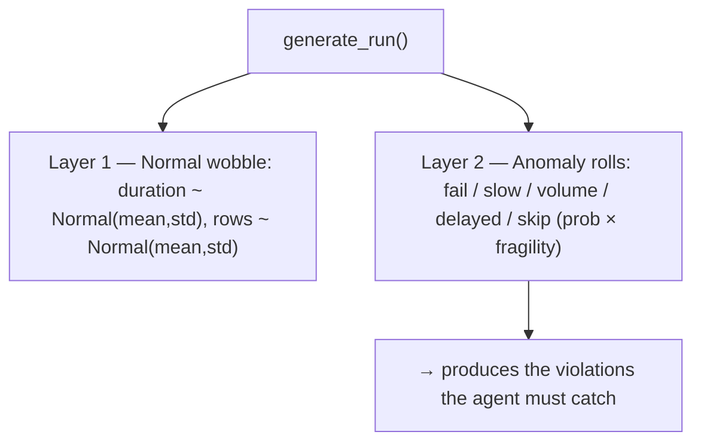
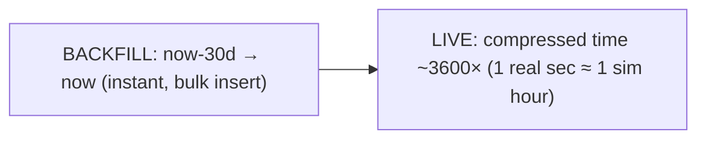

# Slide 7 — Synthetic Data Generation
**Page type:** Content · **Layout:** two-layer diagram + phase strip

---

## [ON SLIDE]
Headline: **Simulating "the world" — realistic runs, injected anomalies**

- **Layer 1 — normal wobble** (always on): small variation in duration & volume
- **Layer 2 — anomaly rolls** (rare): fail / slow / volume dip-spike / delayed / skip
- **SLA headroom:** normal runs never breach by accident → clean signals
- **Failure clustering:** outages persist → recurring failures emerge naturally
- **Two phases:** instant **backfill** (30d history) → compressed **live** (~3600×)
- Result: **~1,017 seeded runs** (907 success / 110 failed)

## [DATA — use these exact values]
**Anomaly injection rates** (base probability × each pipeline's `fragility`):

| Roll | Base prob | Effect | Violation it creates |
|---|---|---|---|
| Fail? | 5% | status=FAILED, weighted error code, ~0 rows | FAILURE / RECURRING_FAILURE |
| Slow run? | 8% | duration × Uniform(1.8, 3.5) | SLA_BREACH |
| Volume anomaly? | 5% | dip ×(0.2–0.4) or spike ×(2.0–3.0) | VOLUME_ANOMALY |
| Delayed start? | 10% | start jitter = Uniform(30, 120) min | DELAYED_START |
| Skip run? | 2% | scheduler emits nothing this cycle | MISSING_LOAD |

- **Failure clustering:** if the previous run FAILED → next fail prob = **50%** and reuses the **same error code** (one root cause).
- **`fragility` per pipeline** (anomaly multiplier): hcp 1.2 · claims 1.0 · formulary 0.8 · sample 0.7 · field_force 1.0 · patient 1.1 · digital 1.5.
- **Backfill** = 30 days; **retention** = 60 days (prune once per sim-day; audit_log exempt).
- **Time compression** = 3600× (1 real sec ≈ 1 sim hour); tick every ~1s; seed is fixed for reproducibility.

## [VISUAL / DIAGRAM DRAFT]
Rebuild as a clean "one run → two layers" fork, plus a small timeline for the two phases.

Phase timeline (rebuild as a simple 2-segment bar):

→ Style: fork diagram as the hero (Layer 1 green = healthy noise, Layer 2 amber/red = injected).
Timeline as a slim strip beneath.

## [SCREENSHOT]
None.

## [SPEAKER NOTES]
- "Nothing is hardcoded — every run is sampled from probability distributions at runtime."
- Explain the two layers: "Layer 1 is ordinary noise so healthy runs vary realistically. Layer 2
  injects the actual anomalies. We keep normal duration **under** SLA — 'SLA headroom' — so a normal
  run never breaches by accident. Every violation is therefore a clean, explainable signal."
- Failure clustering: "Real outages last several runs and share a root cause, so a failed run makes
  the next 50% likely to fail with the **same** error code — that's how RECURRING_FAILURE emerges
  naturally instead of being scripted."
- Each pipeline has a **fragility** multiplier so flaky pipelines (marketing 1.5) misbehave ~2× a
  tightly-controlled one (compliance 0.7), consistently.
- Phases: "We backfill 30 days instantly for baselines, then stream live in compressed time so the
  dashboard visibly moves." ~60s.
