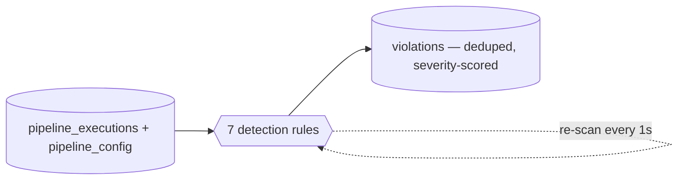

# Slide 8 — The Detection Agent (7 Rules)
**Page type:** Content · **Layout:** rules grid (2×4 or 7 chips) + pipeline strip

---

## [ON SLIDE]
Headline: **The agent: 7 rules turn raw runs into violations**

Rules grid (icon + name + one-line rule):
- **SLA_BREACH** — finished after `scheduled + sla_minutes`
- **DELAYED_START** — started > 15 min late
- **VOLUME_ANOMALY** — rows outside `mean ± 3σ` (**learned** baseline)
- **FAILURE** — run status = FAILED
- **RECURRING_FAILURE** — ≥ 3 failures in rolling 7 days
- **MISSING_LOAD** — expected run never appeared
- **FRESHNESS** — newest good load older than threshold

Bottom band: *Rule-based & explainable today · severity scales with pipeline criticality · idempotent (dedupe_key)*

## [DATA — exact rules & thresholds (from backend/detection.py)]

| # | Type | Exact rule | Base severity |
|---|---|---|---|
| 1 | SLA_BREACH | `duration_minutes > sla_minutes` | MEDIUM |
| 2 | DELAYED_START | `actual_start − scheduled > 15 min` | LOW |
| 3 | VOLUME_ANOMALY | `|rows − mean| > 3·std` over last **20** successful runs; needs ≥ **8** priors | MEDIUM |
| 4 | FAILURE | `status = 'FAILED'` | HIGH |
| 5 | RECURRING_FAILURE | `≥ 3 failures` within rolling **7 days** (rolled to one, cites dominant error code) | HIGH |
| 6 | MISSING_LOAD | gap between consecutive runs `> interval × 1.5` (enumerates each skipped slot; run_id NULL) | HIGH |
| 7 | FRESHNESS | newest success older than `freshness_threshold_hours` (run_id NULL) | MEDIUM |

- **Severity ladder:** LOW < MEDIUM < HIGH < CRITICAL — base bumped **+1** for HIGH-criticality pipelines, **−1** for LOW.
- **"Data now"** = newest `scheduled_time` in the data (high-water mark), so freshness/missing-load stay sane when the sim is paused.
- **Idempotent:** each violation has a deterministic `dedupe_key` (e.g. `SLA_BREACH:<run_id>`) → `INSERT OR IGNORE`.
- **Runs on a loop:** background thread re-scans every **1 second**; `POST /detect` forces an immediate scan.

## [VISUAL / DIAGRAM DRAFT]
Rebuild as a small pipeline: raw runs → 7 checks → deduped violations. Show the 7 as labeled chips.

Severity ladder (small legend): `LOW < MEDIUM < HIGH < CRITICAL` — base per type, bumped by criticality.

## [SCREENSHOT]
None here. *(Detected violations are shown on the Violations screenshot, page 12.)*

## [SPEAKER NOTES]
- "This is what we call the agent today — a deterministic rule engine. Seven checks, each mapping
  1:1 to an anomaly the simulator can inject."
- Highlight the smart one: "VOLUME_ANOMALY doesn't read a threshold from config — it **learns** the
  baseline from each pipeline's last 20 successful runs, three sigma, like real data-observability tools."
- Idempotency: "Every violation carries a deterministic dedupe key, so the agent can re-scan every
  second without ever creating duplicates."
- Severity: "starts from a per-type base and is bumped up for HIGH-criticality pipelines, down for LOW."
- Tee up the future: "Rule-based today — the LLM layer will sit on top of these findings." ~60s.
