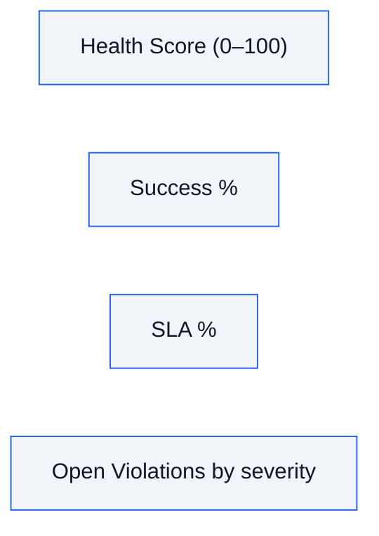
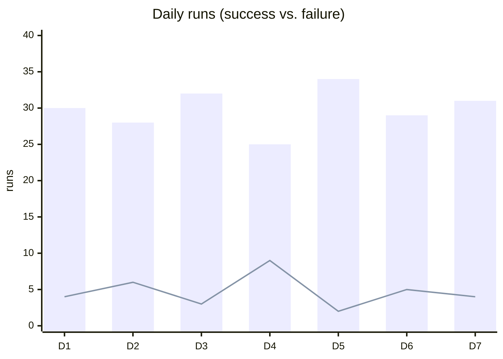

# Slide 9 — KPIs, Analytics & Trends
**Page type:** Content · **Layout:** KPI card row (mock) + mini trend sketch

---

## [ON SLIDE]
Headline: **From violations to fleet health, at a glance**

- **Health Score** — % of runs that were clean (success **and** within SLA)
- **Success rate · Failure rate · SLA compliance** — headline KPIs
- **Open violations** — total + by severity
- **Per-pipeline health** — healthy vs. issues, freshness of last success
- **Trends** — daily success/failure, SLA %, avg duration
- Footer: *All computed on-demand — always as fresh as the last poll*

## [DATA — exact KPI definitions (from backend/kpis.py)]
Rolling window default = **7 days**, measured from "data now" (newest scheduled_time).

- **`health_score`** = share of in-window runs that were **clean** (SUCCESS **and** within SLA)
- **`success_rate`** = successes ÷ total runs · **`failure_rate`** = failed ÷ total
- **`sla_compliance`** = runs finishing within `sla_minutes`
- **`total_runs`**, **`open_violations`** (+ split by severity), **`healthy_pipelines`** vs **`pipelines_with_issues`**
- **Per-pipeline health** (`get_pipeline_health`): run/success/failure counts, SLA breaches, last-success freshness, open-violation count, status = `healthy | issues`
- **Trends** (`get_trends`): daily series — successes/failures, SLA %, avg duration; filterable by category / criticality / pipeline
- **Violation analytics**: totals by type & severity + a daily detection-count series

## [VISUAL / DIAGRAM DRAFT]
Rebuild as a clean **KPI card strip** (mock the cards; do NOT use a screenshot here — the real
screenshot is the next page). Add a small trend-line sketch.

Trend sketch (rebuild as a simple line / stacked-bar mock):

→ Style: 4 KPI cards in a row (health score emphasized), one trend chart beneath. Use success/critical
colors. This slide *describes* the analytics; the next page shows the real thing.

## [SCREENSHOT]
None on this page. **→ Next page (Slide 10) = full-page screenshot of the Overview dashboard.**

## [SPEAKER NOTES]
- "All of this rolls up into one number — a **health score**: the share of recent runs that were
  fully clean, meaning they succeeded *and* stayed within SLA."
- "Around it: success and failure rates, SLA compliance, open violations by severity, and a
  per-pipeline breakdown of who's healthy vs. who has issues."
- Emphasize freshness of numbers: "These are computed on demand from the database, so they're always
  as current as the dashboard's last poll — nothing is precomputed or stale."
- Hand off: "Here's what that looks like in the product." → advance to the Overview screenshot. ~45s.
