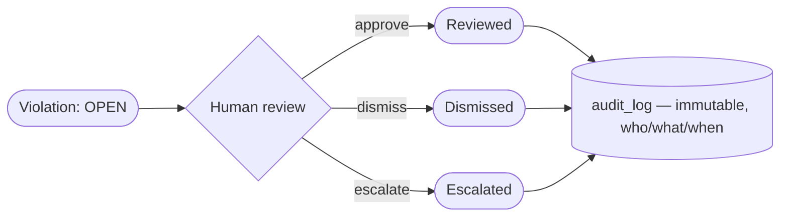

# Slide 11 — Governance & Trust (Human-in-the-Loop)
**Page type:** Content · **Layout:** lifecycle flow + "AI proposes, human disposes" band

---

## [ON SLIDE]
Headline: **Findings are proposals — humans decide**

- **AI proposes, human disposes** — detection surfaces *candidates*, a person validates
- **Violation lifecycle:** `open → reviewed | dismissed | escalated` (single or **batch**)
- **Immutable audit trail** — every decision logged: who · what · when (never pruned)
- Why it matters: **accountability + compliance** (critical in regulated pharma)
- This same gate is where the **future LLM** output will require human approval

## [DATA — exact behavior (from backend/main.py + database.py)]
- **Review endpoint:** `POST /violations/{id}/review` with body `{ action, reviewed_by, note }`
  - `action` ∈ **approve | dismiss | escalate** → sets status to **reviewed | dismissed | escalated**
  - Default reviewer = `analyst` (single-user demo)
- **One atomic operation:** updates the violation **and** appends an `audit_log` row together.
- **Batch review:** one action applied to many selected violations → **one audit row each**.
- **`audit_log` fields:** `timestamp, actor, action` (e.g. `review:approve`), `entity_type` (`violation`), `entity_id`, `details`.
- **Audit is append-only and never pruned** (executions prune at 60 days; the trail persists).
- **Read API:** `GET /audit?actor=&action=&entity=&date_from=&date_to=&limit=`

## [VISUAL / DIAGRAM DRAFT]
Rebuild as a clean state/flow diagram — violation lifecycle feeding the audit log.

→ Style: OPEN in amber; approve=green, dismiss=gray, escalate=red; audit_log as a locked/immutable
cylinder. Add a small "AI proposes → Human disposes" ribbon across the top.

## [SCREENSHOT]
None on this page. **→ Next page (Slide 12) = full-page screenshot of the Violations review workspace.**
**Slide 13 = full-page screenshot of the Audit trail.**

## [SPEAKER NOTES]
- The core principle: "Automated detection is powerful but not infallible — so nothing is treated as
  truth until a human signs off. We call it **AI proposes, human disposes.**"
- Walk the lifecycle: "Every violation starts open. A reviewer can approve, dismiss, or escalate —
  individually or in batch — and each action updates the violation **and** writes an immutable audit
  record in the same operation."
- Why it matters: "That trail is the compliance story — in a regulated pharma context you must be able
  to show who acted on what, and when. The audit log is never pruned."
- Forward link: "This human gate is exactly where the future LLM-generated summaries will plug in —
  the AI drafts, the human approves." ~50s.
