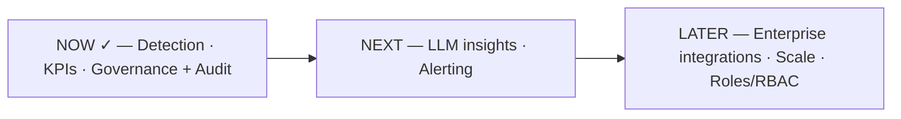

# Slide 14 — Future Scope & Roadmap
**Page type:** Content (closing) · **Layout:** phased roadmap + LLM highlight

---

## [ON SLIDE]
Headline: **Where this goes next**

- 🧠 **LLM / GenAI insights (next up):** plain-English executive summaries, root-cause hints,
  recommended actions — *AI drafts, human approves* (data contract already designed)
- 🔌 **Enterprise integrations:** ingest real logs from Airflow / Databricks / Azure Data Factory / Informatica
- 📈 **Scaling & real-time:** Postgres for scale; cache shared KPIs + horizontal workers;
  **SSE** for push *when* the data layer supports change-notification (not WebSocket — reads are one-directional)
- 👥 **Roles & access control:** auth + RBAC (viewer / analyst / admin), per-team pipeline scoping
- 🔔 **Proactive alerting:** email / Slack / PagerDuty on CRITICAL violations

Closing line: *Detect early · Quantify health · Act with governance — now with AI-generated insight.*

## [DATA — LLM readiness (already designed, from data_schema_design.md)]
- **Endpoint already stubbed:** `GET /report/{name}` (returns "on hold" until a Gemini key is set); UI shows an "AI insights — on hold" slot.
- **Data contract is designed** — the backend sends a compact **structured** summary (not raw rows):
  `period`, `total_pipelines`, `total_runs`, `kpis {health_score, success_rate, sla_compliance, freshness_compliance, failure_count}`,
  `active_violations[]` (pipeline, type, severity, occurrences, `detail`), `performance_trends`, `pipeline_descriptions`.
- **Gemini returns:** executive summary · root-cause indicators · risk assessment · recommended actions.
- **Governance fit:** generated reports pass through the **same human-review gate** (AI drafts → human approves) and get an `audit_log` entry.
- **Reusable-agent goal (from the brief):** the framework is meant to later plug into Airflow / Databricks / ADF / Informatica.

## [VISUAL / DIAGRAM DRAFT]
Rebuild as a clean 3-phase roadmap ribbon (Now → Next → Later), with the LLM as the marquee "Next".

→ Style: three phases left→right; NOW in green (done), NEXT in primary blue (highlight LLM), LATER in
gray. Put a small brain/LLM icon on NEXT. Keep it uncluttered — 3 chips, short labels.

## [SCREENSHOT]
None.

## [SPEAKER NOTES]
- Lead with the LLM since it's the headline deferred feature: "The immediate next step is the GenAI
  layer — natural-language executive summaries and recommended actions. The important part: it plugs
  into the governance gate we just showed — **the AI drafts, a human approves.** The data contract for
  it is already designed."
- Then breadth: "Beyond that: connect to real orchestrators like Airflow and Databricks so it runs on
  production logs, not synthetic data."
- Scaling — the deliberate trade-off (use if asked or to show depth): "We chose polling on purpose:
  it's stateless and self-healing. The first scaling lever is caching the shared KPIs and running more
  stateless workers. If we ever need low-latency push, **SSE** fits better than WebSocket because the
  dashboard is read-only — and it only pays off once we're on a database that can emit change events,
  like Postgres."
- Then roles/RBAC and alerting briefly.
- Close on the one-liner. ~60s. End confidently — this is the last slide.
